# h1 - Oma Linux

## x) Tiivistelmä Raportin kirjoittaminen-artikkelista ja sen esittämistä raportin ominaisuuksista.

Toistettava:
- jos raportti annetaan toiselle samassa ympäristössä, tulee tuloksen olla sama
- myös ympäristö tulee raportoida

Täsmällinen:
- mitä on tehty? (komento, klikkaus)
- onnistuiko, mitä toimen jälkeen tapahtui?
- miten onnistuminen tai epäonnistuminen on todennettu?
- onko työkaluissa tai koneessa vikaa?
  
Helppolukuinen:
- huolellinen kieli, väliotsikot ja mahdollinen tiivistelmä helpottavat lukemista
  
Viittaa lähteisiin:
- viittaukset osoittavat perehtymistä

## a) Linuxin asentaminen virtuaalikoneeseen
Harjoitus tehty kotona sunnuntaina 24.8.2025. Koneena HP Envy x360 kannettava, käyttöjärjestelmä Windows 10. Harjoitus tehty tehtävänannon (Karvinen, Linux-palvelimet) mukaan seuraamalla opettajan ohjeita (Heinonen).

16:03 Latasin VirtualBoxin asennuksen ja aloitin asennuksen Installerissa. 

16:05 VirtualBox asennettu ongelmitta ja avattu.

Seuraavaksi latasin ohjeita seuraten Debian ISO Imagen.

16:07 Aloitin latauksen.

16:10 Lataus oli valmis.

Seuraava askel oli luoda Virtual Machine VirtualBoxiin.

16:14 Aloitin opettajan ohjeissa ensimmäisestä askelesta, eli tarkistin että virtuaalikoneen nimi, kansio ja ISO Image olivat oikein. 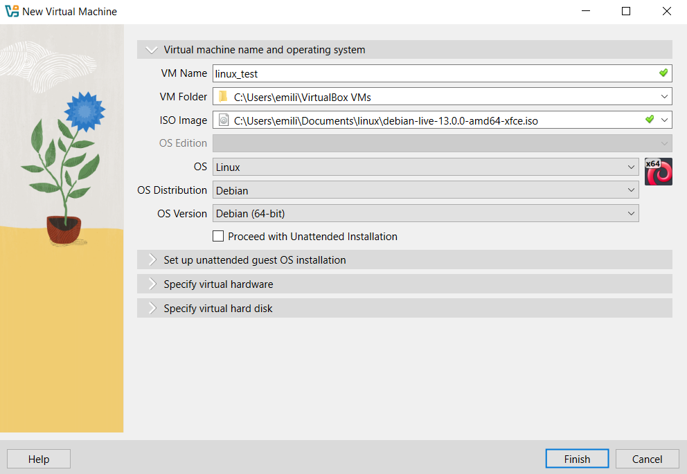

16:16 Tarkistin toisessa kohdassa että muisti ja prosessorit riittävät. 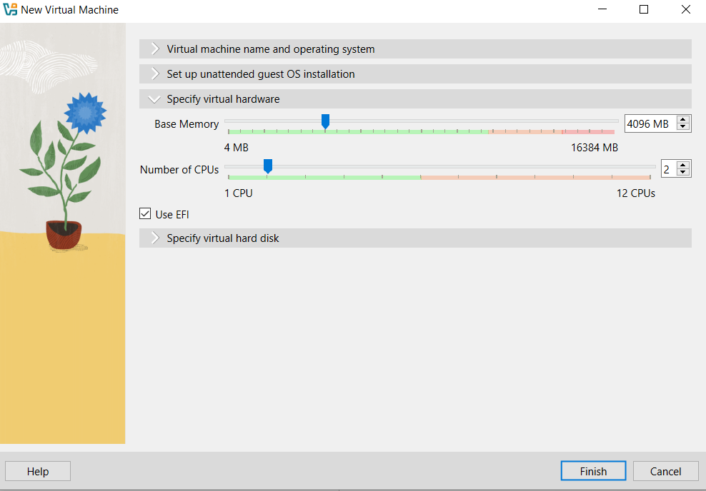

16:19 Tarkistin hard disk-asetukset. 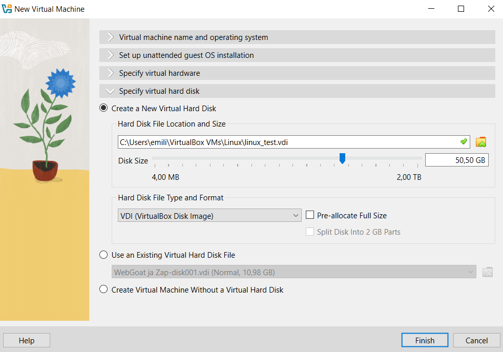

Seuraavana oli Debianin asennus virtuaalikoneeseen, eli aloitin käynnistämällä koneen. 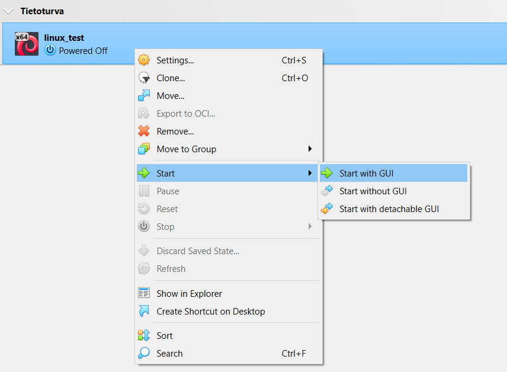

16:21 Valitsin listasta ensimmäisen vaihtoehdon. 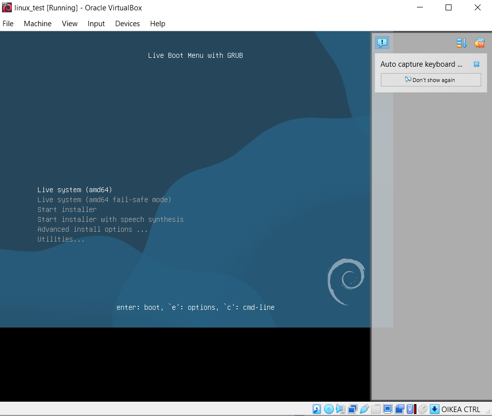

16:25 Sain esiin työpöydän. 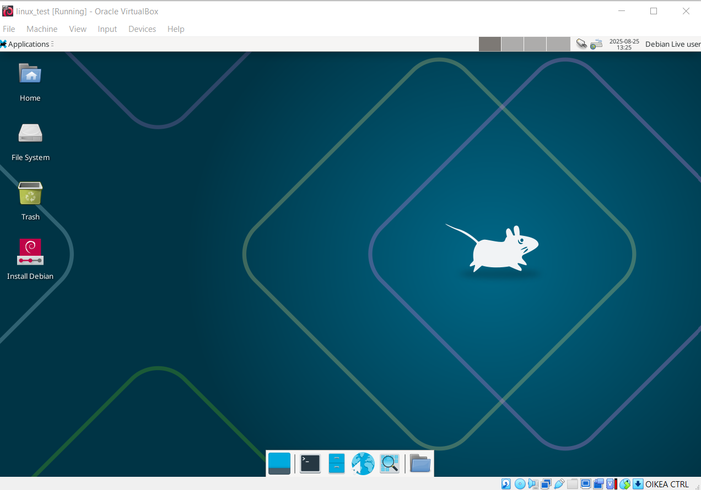

16:26 Koneen selaimessa toimi nettiselain ja sain sieltä esimerkiksi säätiedot esiin. 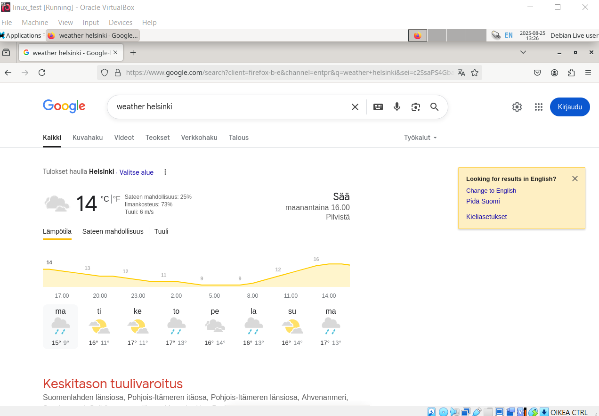

16:28 Myös terminaalissa toimi komennot. 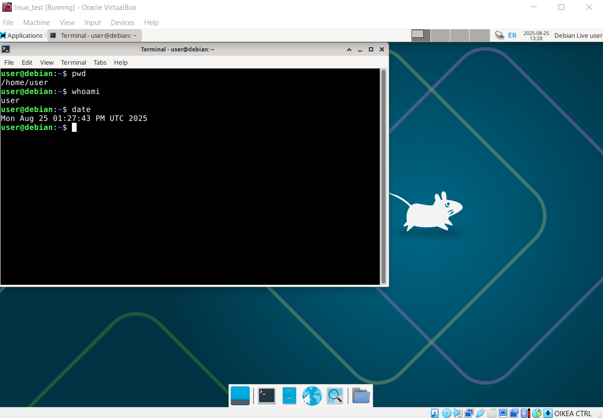

Seuraavaksi tehtiin oikea asennus. Virtuaalikone piti siis käynnistää uudelleen.

16:29 Kirjoitin terminaaliin komennon "sudo reboot" ja valitsin valikosta kohdan "Start Installer".

16:30 Asetin opettajan ohjeiden mukaan parametrit asennukselle, eli valitsin mm. kielen, lokaation, näppäimistön kielen ja käyttäjätunnukset sekä salasanat.

16:45 Asennus onnistui ongelmitta ja painoin Continue käynnistääkseni virtuaalikoneen uudelleen. 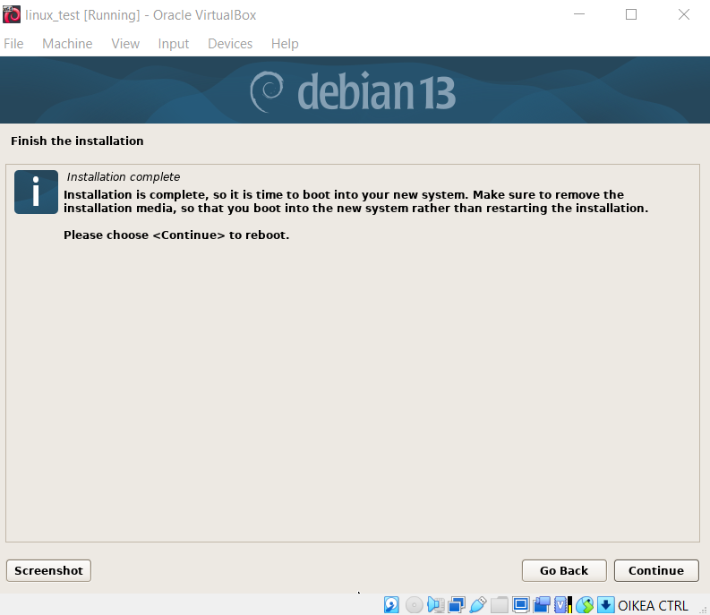

17:09 Yritin tehdä kohtaa 5. Populating sources.list mutta en ihan ymmärtäny mitä tässä piti tehdä. Komento apt-get update antaa virhettä kuten ohjeessa sanotaan. 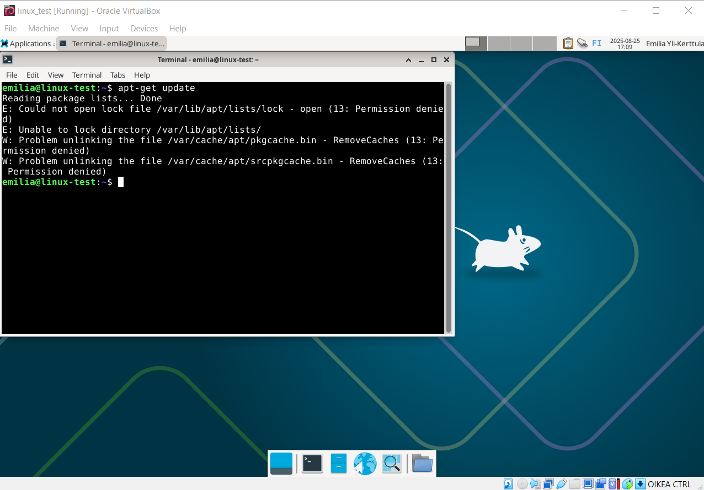

Mutta en tiennyt, mihin ohjeen antamat deb ja deb-src rivit tuli syöttää. Terminaali ei tunnistanut komentoa. 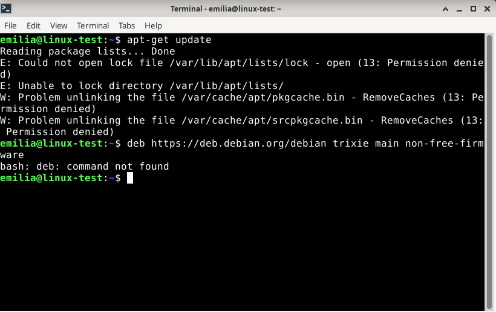

En myöskään onnistunut muokkaamaan itse sources.list-tiedostoa, mutta en saanut muokattua olemassaolevaa tiedostoa tai tehtyä uutta. Jäin jumiin oheiseen ikkunaan. 

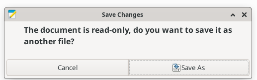

## Lähteet
- Heinonen, J. How to Install Linux to VirtualBox? Luettavissa: https://github.com/johannaheinonen/johanna-test-repo/blob/main/linux-20082025.md. Luettu 24.8.2025.
- Karvinen, T. Linux-palvelimet. Luettavissa: https://terokarvinen.com/linux-palvelimet/. Luettu 24.8.2025.
- Karvinen, T. 4.6.2006. Raportin kirjoittaminen. Tero Karvinen. Luettavissa: https://terokarvinen.com/2006/raportin-kirjoittaminen-4/. Luettu 24.8.2025.
